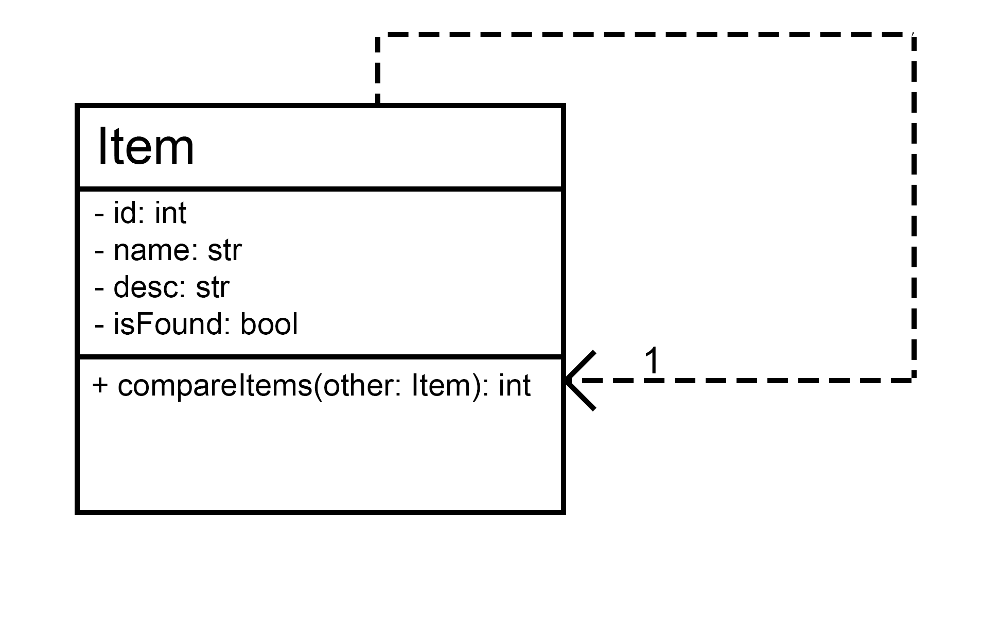

# First Iteration Design and Plans

## Objected Oriented Design

### UML Diagram

## Iteration Backlog

### User Stories to implement...
- As someone who lost something, I want to make a listing for my lost item, so that if someone finds it they can see it.
- As someone who found something, I want to make a listing for an item I found, so if someone has lost the item they can see it.
- (Additional user stroy) As someone who lost something, I want to search listings to see if someone has found the item I am missing.

## Tasks
