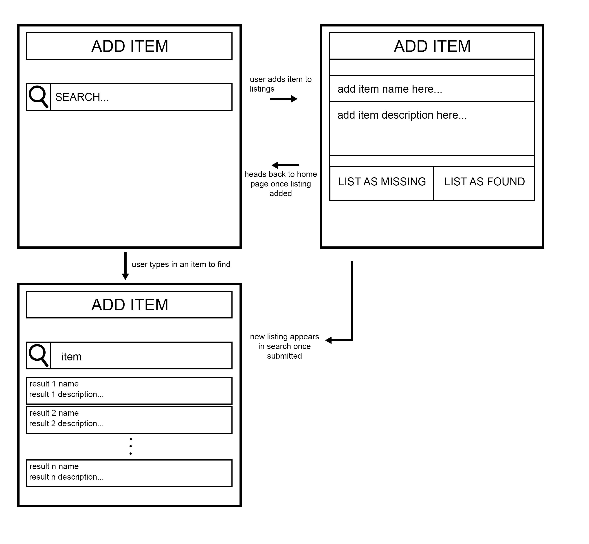

# First Iteration Design and Plans

## Objected Oriented Design

### UML Diagram

## Wireframe

## Iteration Backlog

### User Stories to implement...
- As someone who lost something, I want to make a listing for my lost item, so that if someone finds it they can see it.
- As someone who found something, I want to make a listing for an item I found, so if someone has lost the item they can see it.
- (Additional user stroy) As someone who lost something, I want to search listings to see if someone has found the item I am missing.

## Tasks
- [] Create the search page
- [] Take the search from the search field for server to use
- [] Have server figure out the best results to display from the database
- [] Have server give client search results
- [] Have client display search results
- [] Allow users to create a new item listing
- [] Send item listing from client to server
- [] Save item listing to database
- [] Allow users to delete an item listing
- [] Send delete request from client to server
- [] Delete item listing from database
