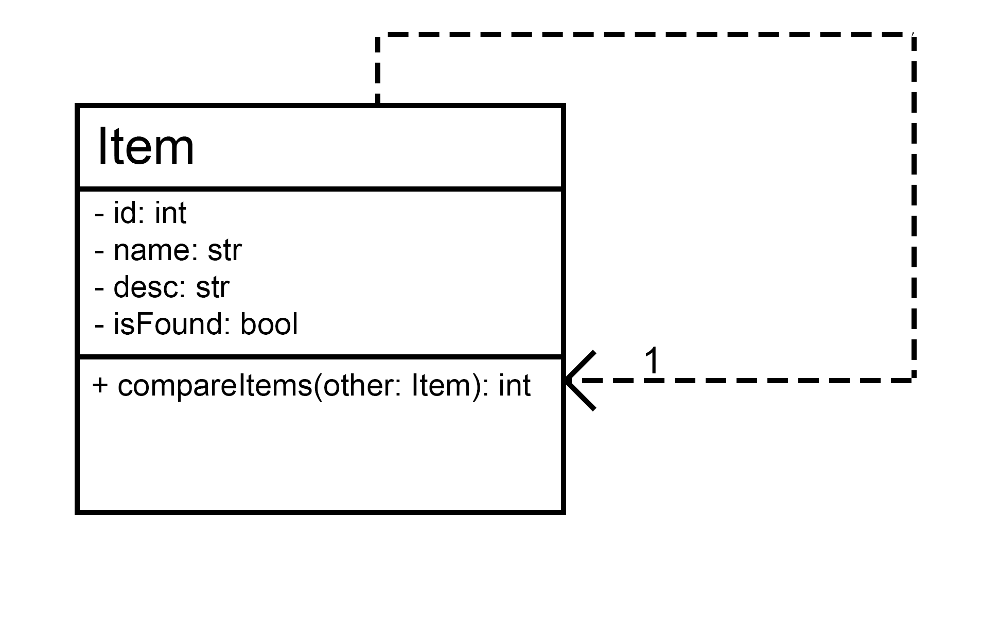
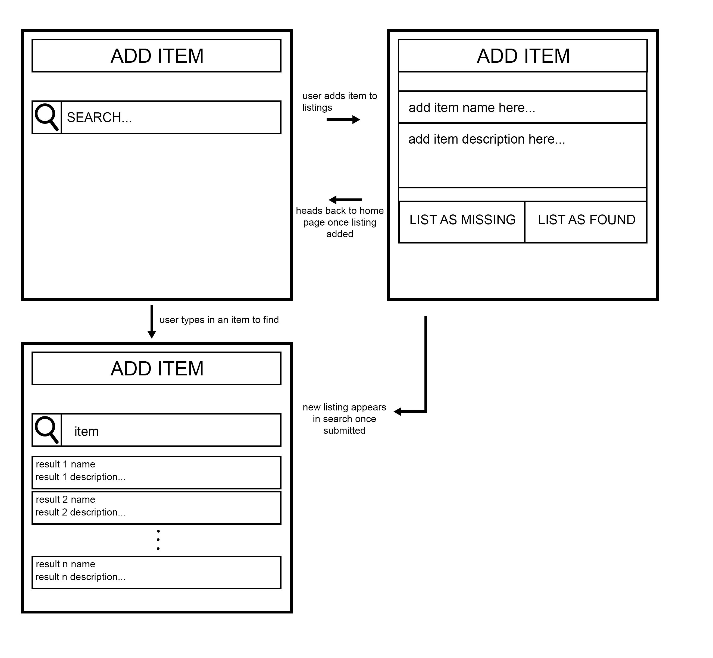

# First Iteration Design and Plans

## Objected Oriented Design

### UML Diagram

## Wireframe

## Iteration Backlog

### User Stories to implement

- As someone who lost something, I want to make a listing for my lost item, so that if someone finds it they can see it.
- As someone who found something, I want to make a listing for an item I found, so if someone has lost the item they can see it.
- (Additional user stroy) As someone who lost something, I want to search listings to see if someone has found the item I am missing.

## Tasks

- [X] Create the search page
- [X] Take the search from the search field for server to use
- [X] Have server figure out the best results to display from the database
- [X] Have server give client search results
- [X] Have client display search results
- [X] Allow users to create a new item listing
- [X] Send item listing from client to server
- [X] Save item listing to database

## Retrospective

We were able to accomplish all of the tasks we listed. From the first iteration, we wanted to implement the basic CRUD functionalities for our lost-and-found app. Despite choosing a stack that was not covered in class (React, Flask, MongoDB), the team was able to get started relatively quickly. The only difficulty we had this iteration was setting up the environment. Since everyone was using a different laptop with different software, we needed to set up a virtual environment for our program so everything could work for everyone. We realized that the steps to set up and run the virtual environment are different between operating systems, so it took a while to make the changes. After setting everything up, we used various tutorials to set up the React frontend and Flask backend. For the next iteration, we will focus on implementing features that would make our program more than just a regular CRUD app, including adding Google Maps API integration, better searching, and deploying on Heroku. We also will reformat some of our code, so that it will be easier to work with in the future.
