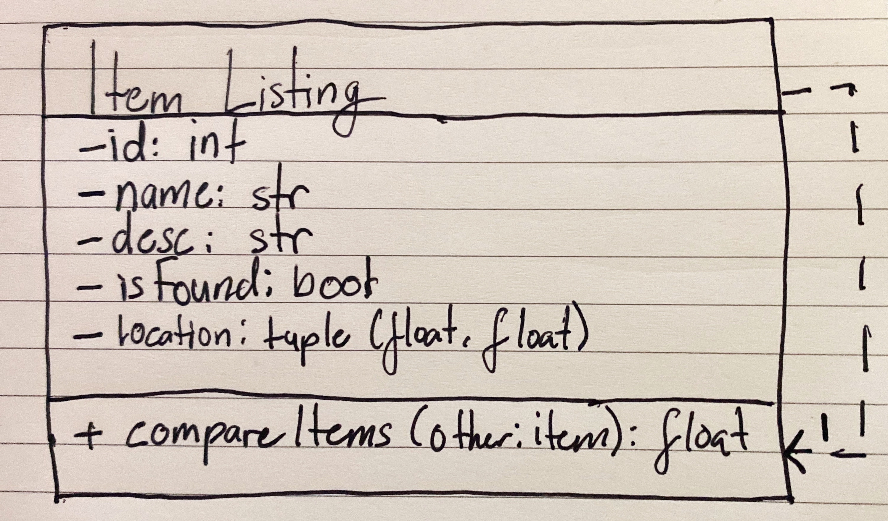
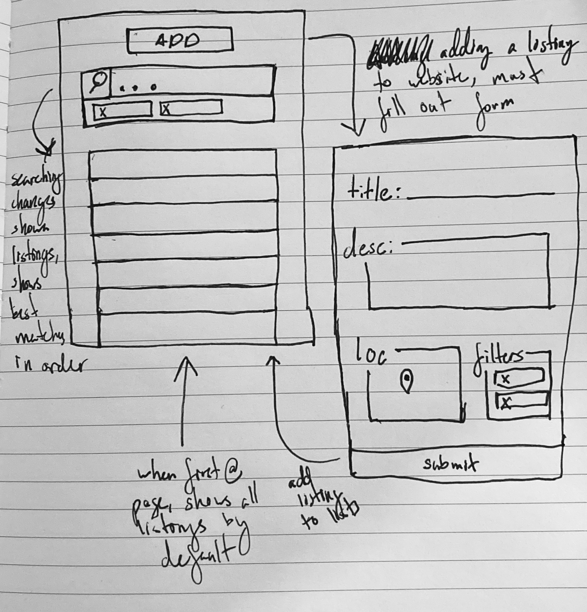

# Second Iteration Design and Plans

## Objected Oriented Design

### UML Diagram

## Wireframe

## Iteration Backlog

### User Stories to implement...

* As someone who lost or found something, I want to be able to search for items, so if can see the listings that match by query.
* As someone who has lost something, I want to set a radius on a map of where I think I lost it, so I can be notified if someone finds something in that area.
* As someone who lost something, I want to be able to filter items based on designated tags, so I can have an easier time finding an item by its properties or functionality.

## Tasks

- [ ] Add item matching to search bar
- [ ] Add test code for search bar
- [ ] Add location field for item listings
- [ ] Allow user to supply location information when creating a listing
- [ ] When displaying listings, show the location of where the item was found on a map
- [ ] Allow users to add tags to items to help filter items out
- [ ] Deploy on Heroku
- [ ] Have tests for new and old code
