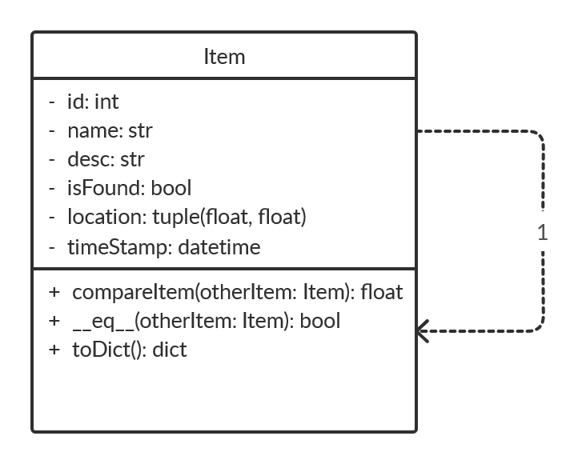

# Third Iteration Design and Plans

## Objected Oriented Design

### UML Diagram

## Wireframe

## Iteration Backlog

### User Stories to implement

* As someone who has lost something, I want to set a radius on a map of where I think I lost it, so I can be notified if someone finds something in that area.
* As someone who lost something, I want to be able to filter items based on designated tags, so I can have an easier time finding an item by its properties or functionality.
* As a user, I want to search through entries with tags so that it is faster to sort through entries.

## Tasks

### Frontend

#### Home Page

* [ ] Eliminate the homepage (Anderson)

#### Add Page

* [ ] Allow user to add tags to their listing when they are being created (Jacob)
* [ ] Allow user to supply radius when adding a lost item (Jacob)
* [ ] Allow user to supply images with their listing (Anderson)

#### Search Page

* [ ] Display the timestamp of listings (Anderson)
* [ ] Allow user to apply tags to the search bar in order to narrow down listing (Jason & Anderson)
* [ ] Allow user to change the order of item listings based on time added, best-matching, etc. (Jason & Anderson)
* [X] List the item as cards (Anderson)
* [ ] Display the image belonging to item listing (Anderson)

### Backend

#### Adding Items

* [ ] Update backend to get timestamp of when an item was created (Shaurya & Andrew)
* [ ] Update backend to get images when a user listing is added (Anderson)
* [ ] Update backend to get radius when a user listing is added (Shaurya & Andrew)
* [ ] Update backend to get tags when a user listing is added (Shaurya & Andrew)

#### Returning Item Listings

* [ ] Allow sorting based on time or best match (Eugene)
* [ ] Improve item listing matching algorithm to match on similar words, not exact (Eugene, Jason and Andrew)
* [ ] Add filtering functionality to narrow results down to only those with the desired tags or qualifications (Shaurya & Eugene)
