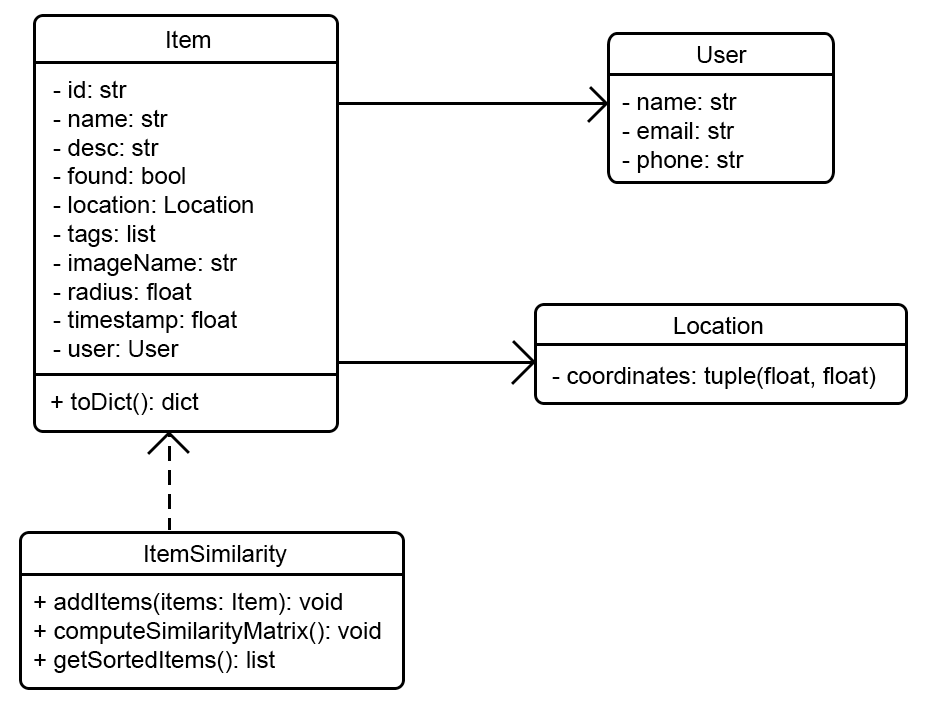

# Fourth Iteration Design and Plans

## Objected Oriented Design

### UML Diagram

## Wireframe

## Iteration Backlog

### User Stories to implement

* As someone who has lost something, I want to be able to search the listings by the location of where the item was found, so I can have an easier time finding my lost item.
* As a user, I want to upload my contact information so someone else knows how to reach me for a lost/found item.
* As someone who has lost something, I want to be notified if someone finds an item similar to mine so I don't have to constantly check the website.

## Tasks

* [ ] Implement algorithm to match similar item images
* [ ] Allow searching based on proximity to a specified location
* [ ] Notify a user by sending them and email if someone posts a found item similar to their lost item (and vice versa) based on matching the item images and location
* [ ] Display the tags an item has on its listing
* [ ] Improve search algorithm
* [ ] Display contact information of a user on the item listing that they posted
