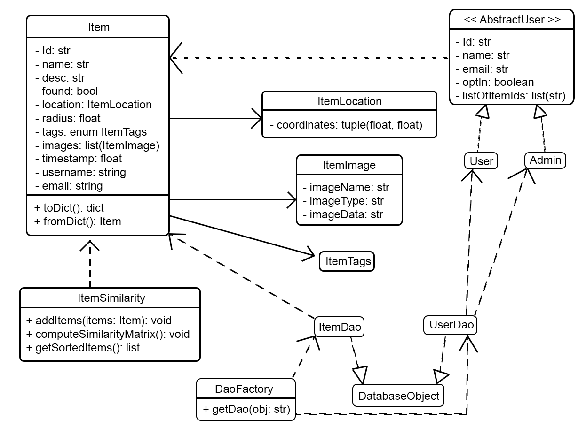

# Fifth Iteration Design and Plans

## Objected Oriented Design

### UML Diagram

## Wireframe

## Iteration Backlog

### User Stories to implement

* As a user, I want to log in with my Facebook or Google account, so I don’t have to make a new account.

## Tasks

### Add

* [X] Set boundary for radius (no negative) should be front end (Anderson)
* [X] Clean up add item page (Anderson)
  * [X] Make map look smaller? (Andrew)
  * [X] Make it easy to tell what inputs of the form are (radius, images) (Anderson)
* [X] Limit so people can only upload a 12 mb picture (Anderson)
* [X] Change the database so that items save images as binaries rather than images locally (Anderson)
* [X] Allow the user to add multiple images when creating a listing (Anderson)

### Search

* [X] Move the search bar to side (Andrew)
* [X] Displaying search boxes (clicking search box should display bigger box and generating mini map) (Jacob)
* [X] Make mini-map for item listing cards be attached to the respective cards (Jacob)
* [X] Prevent the client from sending multiple search requests to the backend until it gets the information from the first request (Jacob)
* [X] Have a loading symbol appear on the search page when the user is searching for an item but has yet to get results back (Jacob)
* [x] Have gensim download file if it is not on directory, otherwise use the one in there (Eugene)

### User Accounts

* [X] Add user authentication (Shaurya, Andrew)
* [ ] Provide the option to opt out of email notifications for users (Shaurya, Andrew)
* [X] Users can only delete their own post (Shaurya, Andrew)
* [X] Add the button for authentication (Shaurya, Andrew)

### General

* [ ] Improve design of the website
  * [ ] Improve navbar (Jason)
  * [ ] Get rid of ugly fonts and colors (Collaboration)
  * [ ] Logo for the project (Eugene)
  * [ ] Footer for page, get rid of the about page (Jason)
* [ ] Document existing code (Everyone)
* [X] Delete any unused code (Eugene)
* [ ] Deploy in production mode (Jason)
* [X] Remove all python wildcard imports and replace them with exact imports (Eugene)
* [ ] Add more test cases (Eugene, Anderson, Jacob, Shaurya)
* [ ] Update dependencies (Jason)
